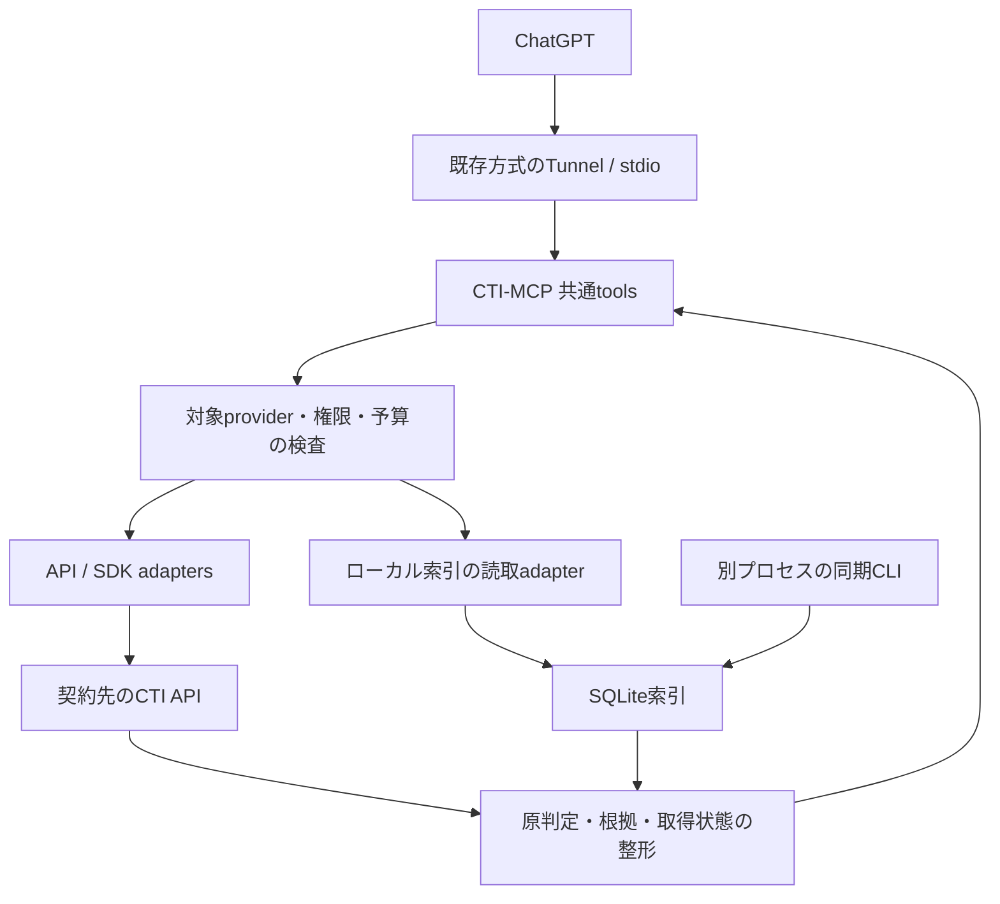

# CTI-MCP 実装方針案

調査基準日: 2026-09-28 / 状態: **設計提案・実装未着手**

本書は構成・入出力・運用境界の設計を扱う。各社のMCP/APIの存在と出典は [provider-survey.md](provider-survey.md)、実装順と承認状況は [Issue #1](https://github.com/Helvetica1248/CTI-MCP/issues/1) を正本とする。実API接続、契約権限の検証、Windows/ChatGPTでの動作確認は未実施。

## 1. 提案の結論

**共通の検索・取得ツールを備えた、独立したPython製の読取用MCPサーバーを作る。** 各社API/SDKと、必要なフィードのローカル索引をprovider adapterで接続する。既存の公式・ベンダー管理MCPは実装例・個別検証候補として活用する。

対象は AhnLab ATIP、BAE Systems、ESET Threat Intelligence、CrowdStrike Falcon Intelligence、Kaspersky、Microsoft MDTI系データ、PwC Threat Intelligence、TeamT5 ThreatVision。VirusTotalは既存VT-MCPを併用する。

主要用途は次の4つ。

- hash / IP / domain / URLを複数CTIで照会し、各社の原判定と根拠を比較する。
- キーワード・期間・providerを指定して脅威レポートを探し、許諾された範囲で本文・IoCを取得する。
- アクター名・別名から関連するレポート・IoCを探す。
- 「日本関連」「Kimsuky」などの調査条件について、出典・更新日・検索できた範囲を示す。

MCP自身に別のLLM・OpenAI Responses呼出しを組み込む必要はない。MCPが証拠を取得・構造化し、接続先のChatGPTが比較・説明する。これにより、初版はCTI APIとMCPの動作確認に集中できる。

## 2. 方式比較

| 方式 | 利点 | 制約 | 判断 |
| --- | --- | --- | --- |
| 各社MCPを個別接続 | 既存実装で早く試せる。ベンダー独自機能を使いやすい | 8社を網羅できず、出力・認証・tool数・更新方式が分散する | Falcon/OpenTIP等の個別比較・試験に利用 |
| 共通MCP + 各社adapter | 照会・根拠・エラーを統一でき、契約や機能の差を表現しやすい | adapterの保守が必要 | **採用提案** |
| OpenCTI/MISPを全社共通基盤にする | フィード蓄積、履歴・関係検索に向く | 追加サービスの運用とデータ保管が増え、即時レピュテーションAPIの完全代替にならない | 既存/必要なMISPフィードを接続。共通基盤の新設は初版の前提にしない |

ベンダー管理MCPが存在しても、購入済み製品のAPIを扱えるか、upload/EDR操作が混在していないか、ライセンスと依存関係が妥当かを確認する。採用単位はサーバー全体ではなく、必要な読取操作とする。

## 3. 構成と接続



初期の想定環境はWindows、専用venv、stdio、既存VT-MCPと同じ接続方式の別profile。新サーバーの互換性は別途実機確認する。stdioサーバー起動後の標準出力はMCP専用とし、資格情報入力は設定用CLIで完結させる。

Python公式MCP SDKの `mcp.server.fastmcp.FastMCP` を第一候補とし、独立した `fastmcp` パッケージと混同しない。Python/SDKの具体的バージョンは初版実装時にサポート状態と接続先の互換性を確認して固定する。HTTPは非同期クライアント、provider SDKは必要なものだけを追加する。同期SDKを使う箇所はbounded workerでイベントループから隔離する。[MCP Python SDK](https://github.com/modelcontextprotocol/python-sdk)

HTTP公開が必要になった場合はStreamable HTTPと認証を別変更として追加する。初版からインターネット公開サーバー、複数tenant、コンテナ群、Redis、ベクトルDBを前提にしない。

### VT-MCPから引き継ぐ点

Windows keyring、企業proxy/CA、stdio起動、出力スキーマ、公開toolの確認という運用上の考え方を引き継ぐ。新サーバーは必要なread操作を明示登録し、VT固有のtool取り込み・実行時差替えに依存しない。

検体取得・提出・sandbox実行・EDR制御はこのCTI-MCPの初版に含めない。CTIレポートの取得と実検体の取得は別の操作として扱う。VT側で既に分離されている検体承認・解析経路は、将来検体を扱う場合の参考にする。

## 4. 共通toolの最小構成

| tool案 | 入力の要点 | 出力の要点 |
| --- | --- | --- |
| `cti_capabilities` | 任意のprovider指定 | 設定/資格情報の有無、対応操作、対応IoC種別、契約確認状態、索引の更新状態。秘密値は返さない |
| `cti_lookup` | 1件または少量のIoC、provider配列、最大結果数 | providerごとの原判定・根拠・状態。指定providerを漏れなく報告 |
| `cti_search_reports` | キーワード、開始/終了日時、provider、limit、cursor | レポートID・タイトル・公開/更新日・関連タグ・引用URL・provider別cursor |
| `cti_get_report` | provider、レポートID、section/offset/limit | 許可されたメタデータ/本文範囲/IoC/出典。全文非対応も明示 |
| `cti_search_actors` | 名称、別名、provider、limit/cursor | provider内のactor ID、名称、別名、関連する根拠 |
| `cti_get_related` | provider、種別、ID、関係種別、limit/cursor | 根拠に結び付くIoC/レポート/actor。明示APIや索引の関係に限定 |

最初に実装するのは `cti_capabilities` と `cti_lookup`。レポートのsearch/getを次に追加し、actor/関係検索は対応APIが確認できたproviderから追加する。表は最終的な共通操作案であり、6 toolが初版で全社対応するという意味ではない。

`cti_capabilities` は無課金の構成確認を既定とし、有償APIへのprobeを自動で発生させない。認証・scope・接続確認はローカルの `doctor` CLIとして明示実行する設計とする。

`providers` を省略した場合は、設定で許可された既定集合のみを照会する。任意のURL、任意HTTPメソッド、任意SQL、shell、provider tokenをtool引数として受け取る汎用toolは用意しない。対応していない検索条件は無視せず、`unsupported_filter` として返す。全文検索に対応しないproviderは `search_scope=metadata` / `local_index` を明示する。

## 5. capabilityと結果の意味

### providerの4段階を分ける

1. **実装可能性:** 公開仕様または契約者資料で操作が確認できたか。
2. **adapter実装:** このサーバーにその操作が実装されているか。
3. **利用権限:** 利用者のAPI/SKU/scopeとデータ利用方針で許可されているか。
4. **動作確認:** 当該アカウント・環境で実APIが成功したか。

「有償CTIを購入済み」「API keyが入力済み」「MCPが存在する」だけでは、この4段階をすべてPASSとしない。

### 結果状態

| 状態 | 意味 |
| --- | --- |
| `ok` | 照会が完了し、有効な結果を返した |
| `not_found` | 成功した照会の対象範囲に一致がない。安全判定ではない |
| `not_configured` | 設定・資格情報が未登録 |
| `not_implemented` | providerの該当adapter操作が未実装 |
| `unsupported` | 当該API/製品では要求された操作・IoC種別を扱えない |
| `unauthorized` / `forbidden` | 認証失敗 / 認証後のscope・契約権限不足など。APIの定義に従い区別 |
| `policy_blocked` | 設定済みのデータ利用方針では出力・外部照会が許可されない |
| `rate_limited` | provider側のレート/クォータ制限 |
| `timeout` / `upstream_error` | 通信期限切れ / 上流障害 |
| `not_queried` | 呼出し予算・期限・キャンセルにより未照会。理由を別フィールドで示す |
| `truncated` | 件数・期間・レスポンスサイズ・呼出し予算により一部だけ取得 |

`stale` は成功/未検出にも併記できる鮮度フラグとし、状態とは分離する。ローカル索引では `last_successful_sync`、同期対象期間、collection/種類、同期完了の有無を返す。期限切れデータへのヒットを最新の判定として扱わない。

batch lookupの最小結果単位は **`input_id × provider`** とする。各入力と指定providerの全組合せについて、照会結果または未照会の理由を返す。provider単位のcoverageはそこから集約し、一部入力だけ照会できたproviderを全件完了としない。

### 原判定・根拠を保持する

providerのseverity、confidence、risk、verdictは別フィールドで保持する。共通表示用の正規化をする場合も、対応表の版と根拠を添える。「値が低い」「レポートに記載がある」「フィードにある」をそれぞれbenign/maliciousと自動決定しない。

providerが明示した判定と、サーバーの構文判定・索引への一致・LLMの推論を区別する。複数CTIの値を平均して総合悪性スコアにする機能は初版の受入条件にしない。

保持する最小項目:

- provider / product / native object ID / adapter version。
- 入力原文、正規化したIoC、IoC種別。
- 原判定、原confidence/severity、時刻の意味が明確な first_seen / last_seen / published_at / updated_at / retrieved_at。
- レポート・actor・フィードの根拠IDと、認証tokenを含まない出典URL。
- TLP/配布条件等のマーキングがある場合はその原値。欠落は `unknown` とし公開可能と推定しない。
- 検索範囲、同期範囲、ページング/打切り状態、APIとローカル索引の別。

同じIoCに関する複数レポートの根拠を保持する。IoC文字列だけで上書きしない。actor名や別名が似ていてもproviderをまたいで同一実体と断定せず、provider内IDを基準に扱う。

### 概念的な応答例

以下は合成データであり、実際のCTI照会結果ではない。

```json
{
  "schema_version": "1",
  "query": {"type": "domain", "value": "example.invalid"},
  "coverage": {
    "requested": ["provider_a", "provider_b"],
    "completed": ["provider_a"],
    "incomplete": ["provider_b"]
  },
  "results": [
    {
      "provider": "provider_a",
      "status": "not_found",
      "verdict_raw": null,
      "stale": false,
      "retrieval_mode": "live_api",
      "evidence": []
    },
    {
      "provider": "provider_b",
      "status": "forbidden",
      "verdict_raw": null,
      "stale": false,
      "retrieval_mode": "live_api",
      "error_code": "ENTITLEMENT_REQUIRED",
      "evidence": []
    }
  ]
}
```

この例から「2社とも未検出」「安全」とは結論できない。ユーザー向けには「1社照会済み・未検出、1社は権限不足」と返す。

## 6. IoC入力・出力

- hashは長さ/16進文字を検証し、小文字へ統一する。
- IPはIPv4/IPv6を構文解析する。私用・loopback等の外部照会方針は設定可能にし、既定では外部へ送らず理由を示す。この規則はURLのhostに含まれるIPにも適用する。
- domainはIDNA等の決められた規則で正規化し、元の表記も保持する。
- URLはscheme/hostとpath/queryを分けて処理する。path/query全体の小文字化やpercent-decodeの繰返しをしない。
- `hxxp` / `[.]` 等は定義済みの変換だけを行い、変換内容を返す。曖昧な入力を自動修復して送信しない。
- userinfo付きURLは既定で照会を拒否する。機密queryや内部名等の送信はprovider別の照会方針で扱い、検知・方針確認が必要な入力は理由を返す。値を黙って削除して別URLを照会し、その結果を元URLの判定として返さない。
- URLに含まれるuserinfoや機密クエリを診断ログへ出さない。CTIへの照会、tool応答、監査ログの3つの取扱いを分ける。
- IoCそのものの宛先へHTTP接続する機能は設けない。CTI APIの既存情報を照会する。API側で能動scanを発生させる操作は別能力として分類し、初版のlookupに含めない。

入力サイズ・件数の上限、構造化出力、出力スキーマを明示する。`readOnlyHint` はサーバー側の操作制限と組み合わせる。外部CTI照会には `openWorldHint=true` を設定する。tool annotationを認可の代用にしない。[MCP tool仕様](https://modelcontextprotocol.io/specification/latest/server/tools)

## 7. ページング・予算・部分失敗

以下の数値は**実装開始時の設定案**であり、ベンダー公認上限や性能測定値ではない。

| 項目 | 初期案 |
| --- | --- |
| 1回のlookup | 既定1件、最大20件。provider数を掛けた要求量を事前に算出 |
| provider横断並列数 | 最大4。provider内は個別の上限を持つ |
| 共通呼出し期限 | 30秒。残り時間を各adapterへ渡す |
| 通信期限 | connect 5秒 / read 15秒を基準にprovider別調整 |
| 外向き通信予算 | 1 tool呼出しあたり40 HTTP requestを初期上限案とする。認証、再試行、ページ取得を含めて計数 |
| 再試行 | 通信障害・一時的5xx・429を限定的に最大2回。残り予算とdeadline内のみ |
| report検索 | 既定20件、最大100件。上流page sizeとは分離 |
| tool結果サイズ | 256 KiBを初期上限案とし、本文をsection/offset/limitで分割 |

`Retry-After` がdeadlineを超える場合は待ち続けず、`rate_limited` と再試行可能時刻を返す。予算超過による残りの入力/providerは `not_queried` とする。401のtoken更新は1回に制限し、403を自動リトライして課金・負荷を増やさない。返金や無料枠は推測しない。

cursorはprovider・元クエリ・権限設定に結び付けた不透明な継続情報とする。複数providerのcursorを別に保持し、1社のページ取得失敗で他社結果を破棄しない。本文・根拠の省略には `truncated` / `next_cursor` / `reason` を付ける。

ベンダーごとの実際のクォータはdoctorの確認結果または契約資料を設定へ反映する。Webポータルの検索回数制限、REST APIレート、feed更新周期は別の制約として扱う。

## 8. 資格情報・ネットワーク・データ利用

### 認証と通信

provider別のWindows keyring名とプロセス内資格情報を使う。OS保護されたbackendが利用できない場合に平文保存へ自動fallbackしない。OAuth client credentials、API key、Basic、JWT更新等はadapter内で扱い、model/tool引数に秘密値を渡さない。

企業proxy認証と追加CA bundleを共通設定から各SDKへ供給する。TLS検証を有効に保ち、407・proxy接続失敗・CA問題・provider認証失敗を区別する。stdio起動中は対話promptを出さない。

providerごとに許可するorigin/API操作を固定する。ページングURL・redirect・レポート内リンクを無条件追跡せず、認証headerを他originへ転送しない。read-onlyは業務操作上の意味であり、OAuth token取得や読取検索用POSTを禁止するという意味ではない。

### データを出す範囲

製品ごとにAPI利用、保存期間、本文取得、外部AIへの送信、引用・再配布を確認する。設定は `metadata_only` / `permitted_excerpt` / `permitted_full_text` 等の出力方針を持たせ、**メタデータなら常に無条件で外部送信できるとは扱わない**。利用条件を確認してproviderを有効化した後の通常の読取に、独自の毎回承認UIは追加しない。

TLPはマーキングとして引き継ぐが、TLPだけで契約上の権利やAI処理許可を判定しない。外部AIへ送れる範囲が未確定のproviderは構成確認までにとどめ、実データを返す機能の有効化を保留する。

公開GitHubに保存するのはソース、設計、合成fixture、機密を含まない確認結果。API key、契約本文、購入済みレポート、実IoCフィード、検索履歴、実DB、`.pyc`、venvをcommitしない。既存の添付ZIPは設計の参照用に限定し、そのまま公開しない。

### 非信頼データ

レポート本文やIoCは分析対象データとして扱う。本文中の命令、追加URLへのアクセス要求、資格情報を含める要求をサーバーの指示として解釈しない。HTMLのscript等を除去してもprompt injectionを完全に除去できたとは扱わず、呼出可能なtool/endpoint/引数の制約で影響を抑える。[MCP security best practices](https://modelcontextprotocol.io/specification/latest/basic/security_best_practices)

## 9. フィードとキャッシュ

BAE/ESET等のフィードは、必要な場合だけ別の同期CLIでSQLiteへ取り込む。MCPの検索途中で全フィードの再同期を開始しない。provider APIが利用できる機能は直接照会を選べる。

SQLiteにはIoC、根拠参照、元object ID、marking、時刻、同期状態を分離して保持する。取込はtransactionとcheckpointを使い、途中失敗を同期完了にしない。削除・revoked・更新情報が供給される場合は反映する。部分同期からの `not_found` は対象期間と未完了状態を伴って返す。

初版はAPI応答の永続cacheを必須にしない。メモリcacheを使う場合は件数/bytes/TTLを制限し、credential・署名付きURL・レポート全文を保存対象にしない。provider、契約profile、query、adapter/schema版をcache keyに含める。認証・権限エラーを未検出としてcacheしない。

永続索引を導入する段階では、provider別と全体の容量上限・保持期間を設定必須とする。容量上限に達したときは古い対象の削除方針に従うか同期を停止し、検索対象範囲を更新する。単にファイルが増え続ける仕様にしない。APIサービス側の提供期間と、利用者側に保存できる期間は別に確認する。

監査ログはprovider・operation・処理時間・状態・件数を中心とし、生のtoken、認証header、proxy password、原文レスポンスを出さない。raw IoC/queryの記録は既定で抑制し、ログにもrotate/容量上限を設ける。

## 10. 添付IoC Lookupから得られるもの

静的に確認した旧実装はAhnLab、Falcon、MDTI、PwC、TeamT5、VTのオンライン照会と、BAE/ESETのMISP同期・ローカルDB照会を備える。Kaspersky connectorは見当たらなかった。この記述は旧添付内の実装状況であり、現行APIへの接続成功を示さない。

引き継ぐのはprovider別connector、非同期照会、proxy対応、providerごとの結果表示という分割。主に見直すのは次の点。

| 観察した問題 | 新設計での対応 |
| --- | --- |
| ローカルDB一致を一律悪性扱い、一部の低スコアをclean扱い | 原判定・根拠一致・推論を分離 |
| URL全体を小文字化して重複排除 | path/queryのcaseを保持 |
| providerごとのpagination/429処理・呼出し予算が不足 | 個別cursor、deadline、Retry-After、部分失敗を共通化 |
| async検索中の同期token取得 | refreshの排他制御と非同期化/worker隔離 |
| MISPの複数根拠・ID・markingを十分保持しない | object ID・report・marking・同期範囲を保持 |
| 現行API/SKUとの対応が未検証 | providerごとに契約確認と最小smokeを行う |

GUI、旧結果クラス、旧SQLiteの内容をそのまま土台にする必要はない。旧コードからAPI候補を発見しても、契約者の現行API資料で確認してから実装する。

## 11. 必要十分な検証

### 設計段階

一次出典と製品範囲、8社の網羅、合成JSON例、文書内リンク、秘密/有償データの混入、未確認事項の明示を確認する。MCP/APIの実通信テストは行っていない。

### 実装段階

- 共通契約: IoC正規化、URL case、未検出/権限不足/部分失敗、scopeがないproviderの隔離、上限・cursorを少数の意味のあるテストで確認。
- adapter: providerごとに成功・空結果・401/403・429・timeout等の必要な分岐を合成/匿名化fixtureで確認。全組合せの網羅は要求しない。
- 動作確認: `tools/list` と出力スキーマ、実資格情報による少数の既知照会、企業proxy、利用するChatGPT接続を確認。
- フィード: 中断後再開、重複根拠保持、古い索引/部分同期の表示、容量上限だけを重点確認。
- Human: 代表的なIoCとレポートで「各社の違い・根拠・未取得の理由が分かる」ことを確認。

実装、オフラインテスト、実API、Windows/ChatGPT接続、Human、merge、配備を別々に記録する。資格情報や契約がなく未実施の項目を、mock成功で完了に置き換えない。

## 12. 実装前に確定する情報

秘密値の提示は不要。必要なのは各社の契約製品/SKU、API利用可否、参照できるAPI仕様の版、必要scope、feedの有無、レポート本文の取得/保存/AI処理に関する方針である。

特に先に確定したいのは次の点。

- CrowdStrike: Falcon IntelligenceのIntel read scopeとAPI利用権。
- ESET: ETIのtier、APIv2/IoC Search/MISP/TAXIIそれぞれの利用可否。
- Kaspersky: OpenTIPと企業向けThreat Lookup/TIP/Threat Analysis/feedsのうち、契約対象となる機能。
- Microsoft: 現在利用するDefender/Sentinel統合先、Graphのapp permission、対象tenantの実アクセス。
- BAE/PwC/TeamT5/AhnLab: 現行契約者API仕様、認証方式、rate/retention、read scope。

これらは設計資料をGitHubへ反映するための阻害条件ではない。次の実装Issueでproviderを有効化する際の受入条件とする。契約が確認できないproviderを待たず、準備できたproviderの読取経路から段階的に実装できる。
