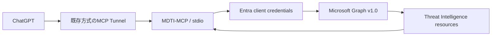

# MDTI-MCP 実装方針

調査基準日: **2026-09-28** / 状態: **設計・実装未着手**

関連するMicrosoft API調査は [mdti-research.md](mdti-research.md)、実装順・承認・進捗は [Issue #1](https://github.com/Helvetica1248/MDTI-MCP/issues/1) を正本とする。

## 1. 目的

MDTI-MCPは、Microsoft GraphのMicrosoft Threat Intelligence APIをChatGPT等から安全にreadし、**単純IoC lookupではなく調査の連鎖**を行いやすくする。

既存のIoC Lookupツールは複数CTIの定型照会を継続して担当する。MDTI-MCPでは次の流れを重視する。

```text
IP / domain
  -> host / reputation
  -> passive DNS等の関連情報

keyword / actor
  -> article / intelligence profile
  -> indicators
  -> 関連hostや別記事の追加調査
```

8社横断の共通provider層、MISP/TAXII同期、各社独自判定の正規化は実装しない。

## 2. 実装原則

- Microsoft Graph Threat Intelligenceのread操作だけを明示登録する。
- Graphのresource modelと取得結果を尊重し、MCP側で根拠のないmalicious/benign変換をしない。
- 任意endpoint・任意OData・任意HTTPを受ける万能toolを作らない。
- 初版では永続DBや全文ローカル索引を持たない。
- MCPサーバー内部で別LLMを呼ばない。Graphから証拠を取得し、解釈はMCPクライアント側に任せる。
- 検体、EDR操作、Sentinel data lakeは別プロジェクト/既存サービスへ任せる。

## 3. 想定構成



初期環境はWindows、専用venv、stdio、既存VT-MCPとは別profileを想定する。接続方式は実装時に現行のChatGPT MCP要件へ合わせて再確認する。

Pythonは公式MCP SDKを第一候補とする。HTTP/認証ライブラリの具体的なバージョンは実装開始時に確認して固定する。

### VT-MCPから引き継ぐ運用上の考え方

- WindowsのOS保護資格情報ストア。
- 企業proxyと追加CA bundleを明示設定し、TLS検証を無効化しない。
- stdio起動後のstdoutをMCPプロトコル専用にする。
- tool list / output schemaを検証する。
- 秘密値をtool resultやログへ出さない。

VT-MCPの検体承認UI、OpenAI hosted container、sample transferはMDTI-MCPには不要。

## 4. Tool構成

名称は実装時のMCP SDK制約を確認して最終確定する。現時点の候補は以下。

### P1: host enrichment

| tool案 | 入力 | 返す内容 |
| --- | --- | --- |
| `mdti_capabilities` | なし | 設定状態、利用可能な機能、API確認状態。秘密値は返さない |
| `mdti_lookup_host` | IPまたはdomain | host ID、Microsoftのhost情報、reputation、取得時刻 |
| `mdti_passive_dns` | host IDまたはIP/domain、limit/cursor | passive DNS recordsとページング情報 |

`mdti_lookup_host` はhashや任意URLを受け取らない。IP/domain以外は `unsupported_input` とする。

### P2: articles

| tool案 | 入力 | 返す内容 |
| --- | --- | --- |
| `mdti_search_articles` | single-term query、limit/cursor等 | article ID、title、summary、published/updated等 |
| `mdti_get_article` | article ID | articleの取得可能な本文・メタデータ |
| `mdti_article_indicators` | article ID、limit/cursor | 記事に関連付いたindicators |

Microsoftの現行個別資料で `$search` がsingle-termに制限されているため、初版はその制約をtool schemaとエラーに明示する。

### P3: intelligence profiles

| tool案 | 入力 | 返す内容 |
| --- | --- | --- |
| `mdti_search_profiles` | query、limit/cursor | profile ID、name、aliases、summary等 |
| `mdti_get_profile` | profile ID | actor/tool等のprofile詳細 |
| `mdti_profile_indicators` | profile ID、limit/cursor | profileに関連するindicators |

必要性が確認できた場合のみ、WHOIS、subdomain、host component等を別toolとして追加する。最初からGraph Threat Intelligenceの全resourceを公開しない。

## 5. 入力と検索

### host

- IPv4/IPv6は構文検証する。
- domainは決めたIDNA正規化を行い、原文も保持する。
- private、loopback、link-local等をGraphへ送る必要は通常ないため、既定では拒否して理由を返す。
- URLからhostを抽出して自動照会する機能は初版に含めない。元URLとhostの意味が変わるため、必要なら明示toolとして後で追加する。

### article/profile検索

- free-formのraw OData filterをtool引数として受け取らない。
- `$top` 等は数値上限を持つ型付き引数にする。
- `$orderby` やfilterを追加する場合は、許可したフィールド/演算子をenum化する。
- unsupportedな検索条件は黙って無視せずエラーまたはwarningで返す。

## 6. 出力モデル

単一providerのため8社統合時のprovider配列は不要。各resultには少なくとも次を持たせる。

```text
schema_version
operation
status
source = microsoft_graph_threat_intelligence
native_id
retrieved_at
query_scope
data
next_cursor / truncated
error_code / retry_after
```

状態は最低限次を区別する。

```text
ok
not_found
unsupported_input
not_configured
unauthorized
forbidden
rate_limited
timeout
upstream_error
truncated
```

`not_found` は安全判定ではない。Microsoftの原reputation/verdict等が存在する場合は原フィールドを保持し、MCPが独自スコアへ変換しない。

indicatorを返す場合は、Graphのnative ID、型、値、関連元article/profile、Graphが返す時刻・説明等を可能な範囲で保持する。

## 7. ページング・上限

以下は実装案でありMicrosoft公認limitではない。live smokeと公式API仕様を確認して調整する。

| 項目 | 初期案 |
| --- | --- |
| host lookup | 1件/呼出し |
| article/profile検索 | 既定20件、最大100件 |
| related indicators / passive DNS | 既定50件、最大200件 |
| HTTP期限 | connect 5秒 / read 20秒を基準 |
| 再試行 | 429/一時5xx/通信障害のみ最大2回、deadline内 |
| MCP結果サイズ | 初期上限256 KiB。本文・大量indicatorはページング |

Graphから `Retry-After` が返る場合は尊重する。deadlineを超える場合は待たず `rate_limited` と再試行可能情報を返す。

Graphの継続URLをそのままtool引数へ公開しない。cursorはMDTI-MCP側でoriginを固定・検証できる不透明値として扱う。

## 8. 認証・権限

初版はapplication permissionを採用する。

```text
Entra application
application permission: ThreatIntelligence.Read.All
OAuth2 client credentials
Microsoft Graph v1.0
```

`ThreatIntelligence.Read.All` 以外のwrite権限を要求しない。Entra appの作成、permission付与、admin consentは環境側の変更であり、実装PRとは分けて承認・記録する。

client secretはMCP tool引数・設定ファイル・GitHubへ保存しない。WindowsのOS保護ストアを第一候補とし、利用できない場合に平文へ自動fallbackしない。

Microsoft公式overviewと古い個別APIページでライセンス記載に差があるため、P0のlive smokeを通るまで `entitlement_verified=false` とする。

## 9. ネットワークと企業proxy

許可する外向き通信先は認証とGraphに限定する。実装時にMicrosoftの現行token endpointとGraph endpointを確認し、必要なoriginだけを設定する。

- proxy username/passwordはプロセス環境またはOS保護ストアから渡し、プロジェクトへ保存しない。
- corporate CA bundleを設定可能にする。
- TLS verification off、`--trusted-host` 相当の回避は行わない。
- 407、DNS/connection、TLS、Entra認証、Graph 401/403を区別して診断する。
- redirect先へAuthorization headerを無条件転送しない。

## 10. データ取扱い

Microsoft Threat IntelligenceのAPI結果をChatGPTへ渡すことについて、組織の契約・データ利用方針をP0で確認する。

初版はGraph responseの永続cacheを持たない。メモリ内の短時間cacheが必要になった場合も件数/TTLを制限し、access tokenや資格情報をcache対象にしない。

監査ログはoperation、処理時間、HTTP status、件数等を中心とする。生access token、Authorization header、client secret、原文response全体を記録しない。検索語やIoCのログは既定で抑制する。

記事本文は非信頼データとして扱う。本文中の命令文をMCPサーバー自身への指示として解釈せず、追加URLやtool実行を本文から自動生成しない。

## 11. Sentinel MCPとの境界

MDTI-MCPはMicrosoft公式Sentinel MCPと競合しない。

```text
MDTI-MCP
  Microsoft Graph Threat Intelligenceのread
  raw/structured intelligenceを取得

Sentinel MCP
  Sentinel data lake / graph / incident
  KQL探索、triage、Entity Analyzer
```

`analyze_url_entity` 等のSentinel Entity AnalyzerはAI推論・組織データ・Security Copilot SCUを利用するため、MDTI-MCPのhost lookupとは別能力として扱う。

## 12. 最小十分な検証

### Offline

- MCP `tools/list` とoutput schema。
- IP/domain入力検証とunsupported input。
- typed queryとsingle-term article検索制約。
- 200 / empty / 401 / 403 / 429 / timeout / 5xxの代表分岐。
- pagination/cursor、結果サイズ上限。
- token/secretがresultとログへ出ないこと。

すべてのGraph resourceやHTTPエラー組合せを網羅するテストは要求しない。

### Live API

P0完了後、実tenantで最小限次を確認する。

- token取得。
- 既知のIPまたはdomain 1件のhost取得。
- passive DNSまたはreputation取得。
- article検索1件とarticle取得。
- intelligence profile検索/取得。
- 429を意図的に発生させる負荷試験は行わない。

### Windows / ChatGPT

- 企業proxy環境で起動・Graph read。
- ChatGPTからtool一覧が見えること。
- host → article/profile → indicatorの代表的調査フロー。

Machine PASSとHuman PASSを分ける。offline mock成功だけでlive APIを完了扱いしない。

## 13. 実装フェーズ

実装順はIssue #1を正本とする。

```text
P0  Entitlement / Entra / data policy確認
P1  MCP共通基盤 + host / reputation / passive DNS
P2  articles + article indicators
P3  intelligence profiles + profile indicators
P4  proxy/diagnostics/配布・必要な追加enrichmentのみ
```

追加機能は実際の調査で不足が確認されたものだけを採用する。汎用Graph proxy、全Microsoft Security API対応、他社CTI再統合はスコープ外。
